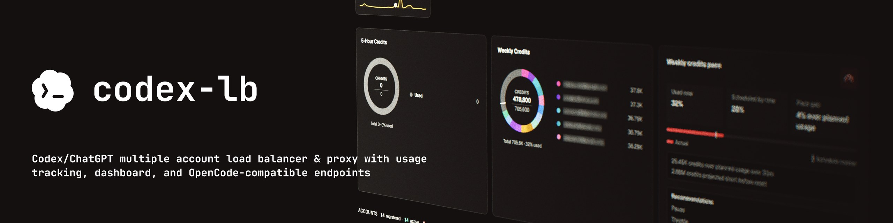
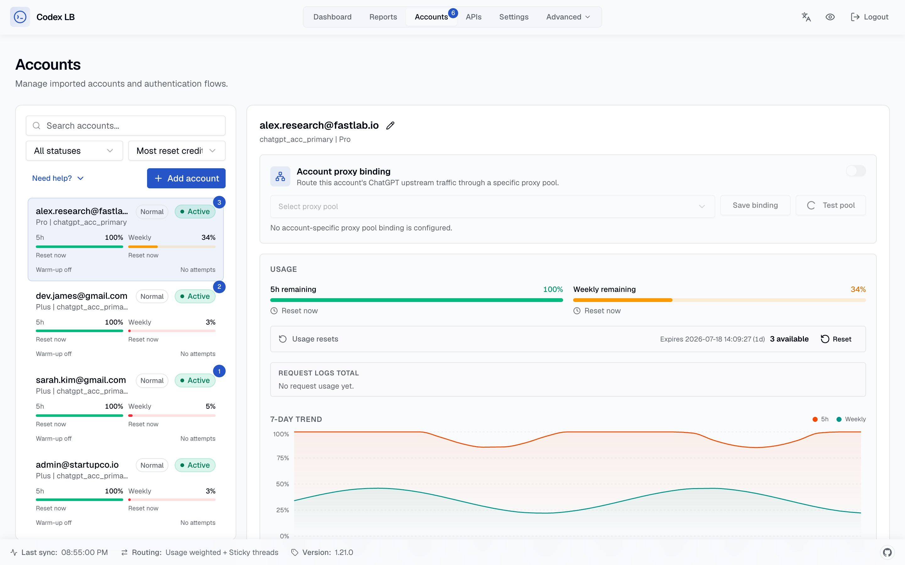

# codex-lb



**Tiếng Việt** | [English](./README.en.md)

Hệ thống cân bằng tải (Load Balancer) & Proxy cho các tài khoản ChatGPT/Codex. Gom nhóm nhiều tài khoản (Account Pooling), theo dõi mức sử dụng hạn mức, quản lý API Keys, tự động đăng nhập và xoay tài khoản thông minh trực tiếp trên Dashboard.

**Tài liệu hướng dẫn:** Xem chi tiết đầy đủ trong thư mục [docs/](docs/index.md) — hướng dẫn bắt đầu, kết nối client, cấu hình, triển khai và xử lý sự cố.

## Tính Năng Nổi Bật

<table>
<tr>
<td><b>Gom nhóm tài khoản (Account Pooling)</b><br>Tự động cân bằng tải và luân chuyển thông minh giữa nhiều tài khoản ChatGPT</td>
<td><b>Theo dõi mức sử dụng (Usage Tracking)</b><br>Thống kê số lượng Token, chi phí, hạn mức tuần và xu hướng 28 ngày của từng tài khoản</td>
<td><b>Quản lý API Keys</b><br>Giới hạn tốc độ (Rate Limit) theo Token, chi phí, khung giờ và Model cho từng Key</td>
</tr>
<tr>
<td><b>Bảo mật Dashboard</b><br>Xác thực qua Mật khẩu + mã bảo mật 2 lớp (TOTP/2FA)</td>
<td><b>Tương thích chuẩn OpenAI</b><br>Tương thích 100% với Codex CLI, OpenCode, OpenClaw, Python SDK và mọi client OpenAI</td>
<td><b>Tự động đồng bộ Model & Xoay Acc</b><br>Tự động lấy danh sách Model từ upstream, hỗ trợ Auto Login và xoay acc tự động</td>
</tr>
</table>

|  |  |
|:---:|:---:|

## Khởi Động Nhanh

```bash
# Sử dụng Docker (Khuyên dùng)
docker volume create codex-lb-data
docker network inspect codex-lb-net >/dev/null 2>&1 || docker network create codex-lb-net
docker run -d --name codex-lb \
  --network codex-lb-net \
  -p 2455:2455 -p 1455:1455 \
  -v codex-lb-data:/var/lib/codex-lb \
  ghcr.io/vanle1101/codex-lb:latest

# Hoặc khởi động nhanh qua uvx
uvx codex-lb
```

Mở trình duyệt truy cập [http://localhost:2455](http://localhost:2455) → Thêm tài khoản → Bắt đầu sử dụng.

> Nếu truy cập Dashboard từ xa (remote) lần đầu tiên, bạn cần mã token khởi tạo một lần (bootstrap token) — xem [Hướng dẫn bắt đầu](docs/getting-started.md).

## Cấu Hình Client

Bạn có thể trỏ bất kỳ ứng dụng nào hỗ trợ chuẩn OpenAI về codex-lb. Ví dụ đối với Codex CLI, cấu hình file `~/.codex/config.toml`:

```toml
model = "gpt-5.6-sol"
model_reasoning_effort = "xhigh"
model_provider = "codex-lb"

[model_providers.codex-lb]
name = "openai"  # bắt buộc — kích hoạt tính năng /responses/compact từ xa
base_url = "http://127.0.0.1:2455/backend-api/codex"
wire_api = "responses"
supports_websockets = true
requires_openai_auth = true # bắt buộc cho ứng dụng codex
```

| Logo | Ứng dụng (Client) | Cổng kết nối (Endpoint) | Hướng dẫn chi tiết |
|---|--------|----------|-------|
|  | **Codex CLI / IDE** | `http://127.0.0.1:2455/backend-api/codex` | [Cấu hình Client → Codex CLI](docs/client-setup.md#codex-cli-ide-extension) |
|  | **OpenCode** | `http://127.0.0.1:2455/v1` | [Cấu hình Client → OpenCode](docs/client-setup.md#opencode) |
|  | **OpenClaw** | `http://127.0.0.1:2455/v1` | [Cấu hình Client → OpenClaw](docs/client-setup.md#openclaw) |
|  | **Hermes Agent** | `http://127.0.0.1:2455/v1` | [Cấu hình Client → Hermes Agent](docs/client-setup.md#hermes-agent) |
|  | **OpenAI Python SDK** | `http://127.0.0.1:2455/v1` | [Cấu hình Client → Python SDK](docs/client-setup.md#openai-python-sdk) |

Các ứng dụng kết nối từ xa cần tạo [API Key](docs/api-keys.md) từ trang Dashboard.

## Cấu Hình Hệ Thống

Thiết lập thông qua các biến môi trường có tiền tố `CODEX_LB_` hoặc file `.env.local` — xem [`.env.example`](.env.example) và [Tài liệu cấu hình](docs/configuration.md). Mặc định hệ thống sử dụng SQLite; bạn có thể tùy chọn dùng PostgreSQL qua biến `CODEX_LB_DATABASE_URL`.

## Lưu Trữ Dữ Liệu

| Môi trường | Đường dẫn thư mục dữ liệu |
|-------------|------|
| Cài đặt trực tiếp / uvx | `~/.codex-lb/` |
| Docker | `/var/lib/codex-lb/` |

Hãy sao lưu thư mục này để đảm bảo an toàn dữ liệu tài khoản của bạn.

## Tài Liệu Tham Khảo

Toàn bộ tài liệu chi tiết có tại thư mục [docs/](docs/index.md):

- [Hướng dẫn bắt đầu](docs/getting-started.md) — Khởi động nhanh, lấy mã token bootstrap từ xa
- [Cấu hình Client](docs/client-setup.md) — Kết nối Codex CLI, OpenCode, OpenClaw, Python SDK
- [Cấu hình môi trường](docs/configuration.md) — Các thông số cấu hình quan trọng
- [Xác thực & Bảo mật](docs/authentication.md) — Các chế độ đăng nhập Dashboard
- [Quản lý API Keys](docs/api-keys.md) — Bảo vệ và phân quyền proxy
- [Chiến lược định tuyến](docs/routing.md) — Cơ chế xoay và chọn tài khoản
- [Cơ sở dữ liệu](docs/database.md) — SQLite / PostgreSQL, nâng cấp phiên bản
- [Triển khai hệ thống](docs/deployment/docker.md) — Docker, Kubernetes, Remote Access
- [Xử lý sự cố](docs/troubleshooting.md) — Khắc phục các lỗi thường gặp

## Môi Trường Phát Triển (Development)

```bash
# Docker
docker compose watch

# Chạy trực tiếp (Local)
uv sync && cd frontend && bun install && cd ..
uv run codex-lb                              # backend cổng :2455
```
